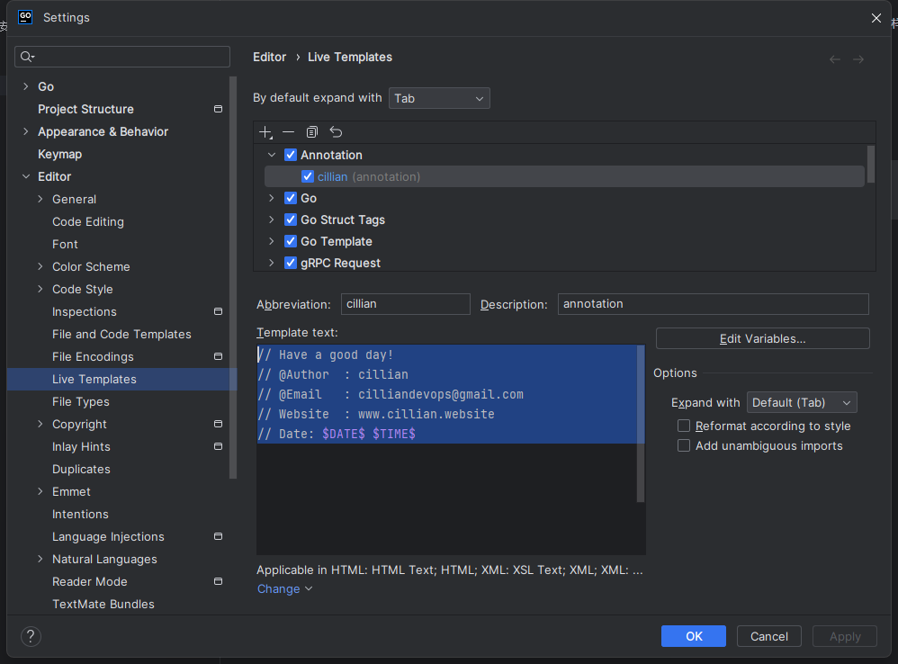
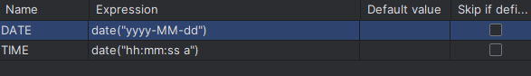

## 1、goland快速注释


### 方法一
ctrl+alt+s 调出设置界面，选择plugins选项，这里面搜索goanno插件,安装完成后，在tools工具栏里面，设置注释默认样式即可

### 方法二



```
// Have a good day! 
// @Author  : cillian
// @Email   : cilliandevops@gmail.com
// Website  : www.cillian.website
// Date: $DATE$ $TIME$
```


### 2、代理设置

1、go模块代理https://goproxy.cn/

2、windows powershell 执行
```
C:\> $env:GO111MODULE = "on"
C:\> $env:GOPROXY = https://goproxy.cn
```
